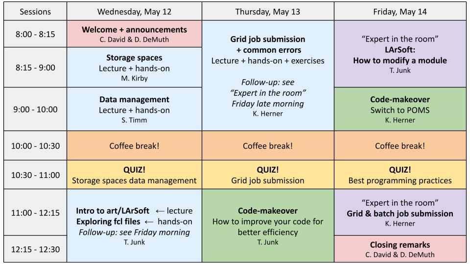

This tutorial will teach you the basics of DUNE Computing. It is split into four parts that you can attend independently (we advise newcomers to follow the whole event though).

Each part will have a little introduction followed by hands-on sessions in breakout rooms. Here mentors will answer your questions and provide technical support.

<!-- this is an html comment -->

 This is a comment in Liquid 

> ## Prerequisites
>
> Command line experience is necessary for this lesson. We recommend the
> participants to go through
> [The Unix Shell](https://swcarpentry.github.io/shell-novice/), if new to the
> command line (also known as terminal or shell).  
{: .prereq}

By the end of this workshop, participants will know how to:

* Utilize data volumes at FNAL.
* Understand good data management practices.
* Provide a basic overview of art and LArSoft to a new researcher.
* Develop configuration files to control batch jobs.
* Monitor jobs submitted to the grid.

> ## Getting Started
>
> To get started, follow the directions in the "[Setup](
> {{ page.root }}/setup.html)" tab to download data to your computer and follow
> any installation instructions.
{: .callout}

You will need a valid FNAL or CERN account to be able to do the tutorial and be on the DUNE Collaboration member list. If you do not, contact your team leader.

<h2 id="schedule">Schedule by Day</h2>

<!--  -->

An [asynchronous session]({{site.baseurl}}/asynchronous/) is designed as later day acivities for the first two days of the workshop.


